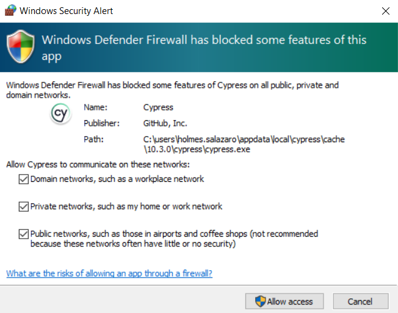
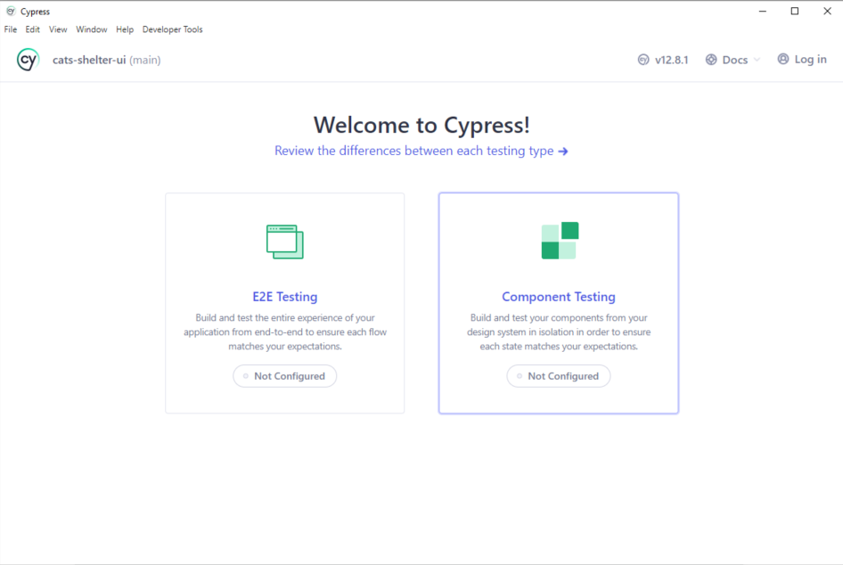
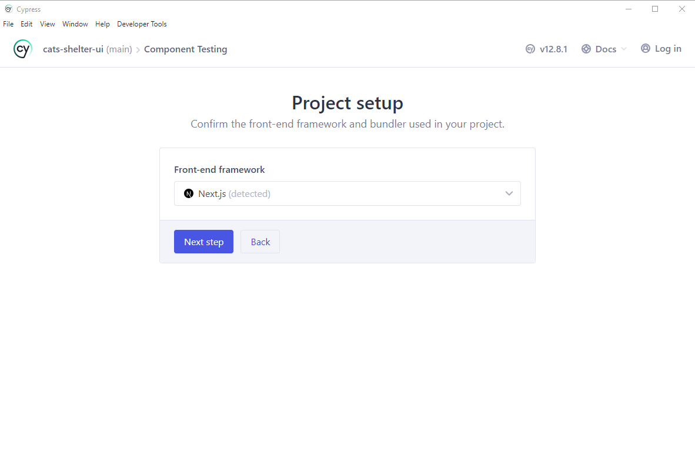
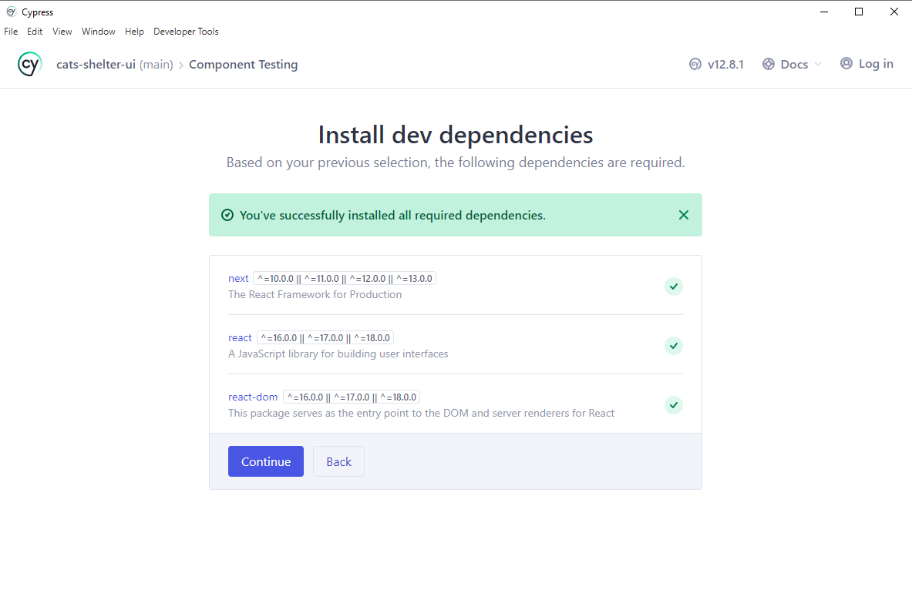
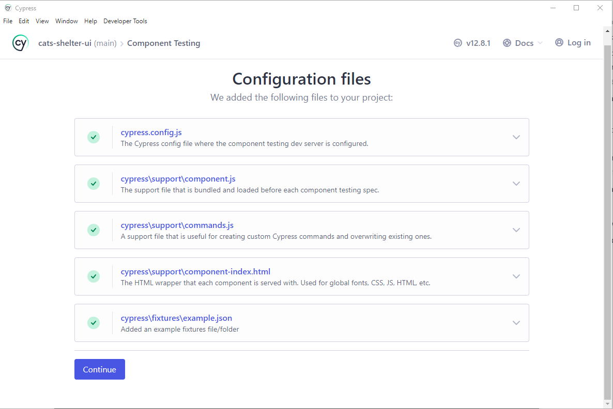
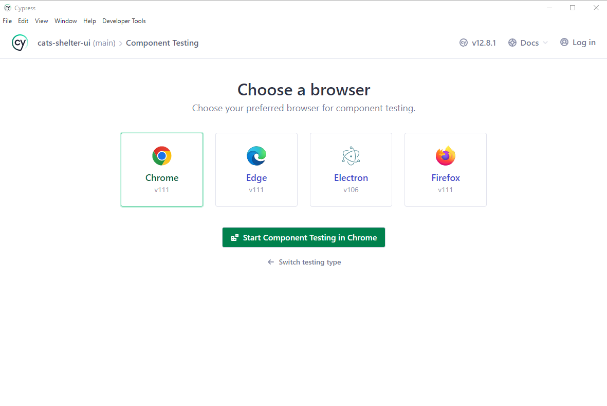
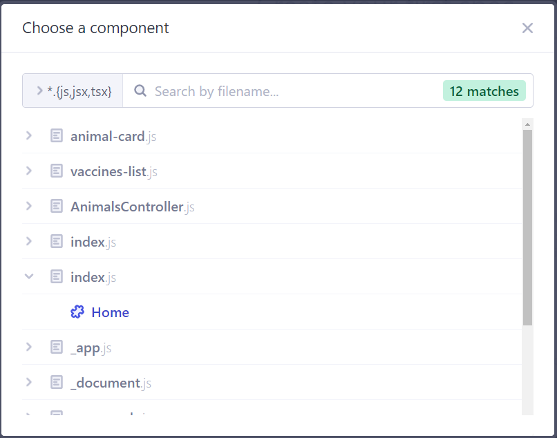

# Sesion 7: UI Component Testing with Cypress

## Objetivo
Este ejercicio tiene como objetivo aprender a configurar y ejecutar pruebas de Componentes de UI por medio de [cypress](https://www.cypress.io/).

## Actividad

### 1. Preparacion

Dado que las pruebas de componentes tienen un enfoque shift-left se hace necesario conocer el codigo de la aplicacion sujeta a pruebas. Es por ello, que para esta actividad, utilizaremos una pequeña aplicacion, cuyo front-end y back-end se encuentran en repositorios separados.

1. Realice un fork del back-end de la aplicación: [animal-shelter-backend](https://github.com/holgiosalos/animal-shelter-backend)
2. Realice un fork del front-end de la aplicación: [cats-shelter-ui](https://github.com/holgiosalos/cats-shelter-ui)

### 2. Verificar funcionamiento del Back-end

1. Clone su fork personal del back-end de la aplicacion: "animal-shelter-backend"
2. Ejecute el siguiente comando, para instalar las dependencias necesarias:

    ```bash
    npm install
    ```

3. Para poner en ejecucion la API:

   ```bash
   npm start
   ```

4. Verifique que el back-end esta ejecutandose bien accediendo al siguiente link: [http://localhost:8080/](http://localhost:8080/)

   Debera salir un mensaje que diga: "Animals Shelter API!"

### 3. Verificar funcionamiento del Front-end

1. Clone su fork personal del front-end de la aplicacion: "cats-shelter-ui"
2. En la carpeta raiz, cree un archivo llamado `.env`, con la informacion de la API:

   ```env
   API_URL=http://localhost:8080
   ```

3. Ejecute el siguiente comando, para instalar las dependencias necesarias:

    ```bash
    npm install
    ```

4. Para poner la ejecucion la aplicación, ejecute:

   ```
   npm run dev
   ```

5. Verifique que el front-end esta ejecutandose bien accediendo al siguiente link: [http://localhost:3000/](http://localhost:3000/)

   Debera abrirse una pagina con dos opciones:

   - Register Animal
   - List Animal

### 4. Instalación de Cypress

1. En la raiz del front-end, Ejecutar el siguiente comando:

   ```bash
   npm install -D cypress
   ```

2. Esto instalará cypress dentro del **node_modules**. Para verificar la correcta instalacion e iniciar la configuracion para ver el demo de cypress, ejecutamos el siguiente comando:

   ```bash
   npx cypress open
   ```

   - Si te aparece un mensaje de Windows Defender similar al de la imagen, selecciona todas las opciones y presiona el boton Allow Access.
      

   - Después, se abrirá una ventana dandote la bienvenida Cypress. Te dara a escoger entre dos opciones (E2E Testing y Component Testing). Selecciona Component Testing.
      

   - Luego, Cypress mostrará el Framework que estamos usando, en este caso Next.js (sino aparece ningun framework, seleccionar Next.js)
      

   - A continuacion, Cypress instalará algunas dependencias necesarios. En este caso, ya estan instaladas
      

   - Despues, Cypress mostrará el contenido de 5 archivos que agregará a nuestro proyecto: `cypress.config.js`, `cypress\support\component.js`, `cypress\support\commands.js`, `cypress\support\component-index.html`, y `cypress\fixtures\example.json`. Presiona el boton de continuar.
      

   - Una vez Cypress termina la configuracion inicial, te pedira que selecciones uno de los navegadores soportados. Seleccionaras `Chrome`, y luego presionaras el botón "Start Component Testing in Chrome".
     

3. En este punto ya hemos terminado la configuracion inicial. Observar que se crea una carpeta llamada **cypress** con [la siguiente estructura](https://docs.cypress.io/guides/core-concepts/writing-and-organizing-tests.html#Folder-Structure)

4. Crear una rama llamada "cypress-setup" y realizar un commit donde incluya los archivos creados y/o modificados en esta sección, con el mensaje “setup cypress configuration” y subir los cambios al repositorio

5. Crear un pull request (PR), y realizar el merge.

6. Despues de fusionar los cambios, recuerde hacer `checkout` a la rama main y despues hacer `pull`.

### 4. Primera prueba de Componentes

1. Crear una nueva rama a partir de main. (nombre sugerido: `first-component-test`)

1. Empezaremos configurando un script para lanzar las pruebas, agregando la siguiente linea al conjunto de `scripts` dentro del archivo `package.json`:

   ```json
   "test:component:open": "cypress open",
   ```

1. Lanzamos Cypress con el nuevo comando:

   ```bash
   npm run test:component:open
   ```

1. Seleccionamos el test type de "Component Testing"

1. Despues, seleccionamos "Chrome" y damos clic al boton "Start Component Testing in Chrome"

1. En el navegador de Cypress, seleccionamos la opcion "Create from Component"

1. Buscamos el archivo `pages/index.js` y seleccionamos el componente "Home".
   

1. Luego cypress nos sugerirá una estructura para el archivo de prueba de ese componente. Presionamos el boton "Okay, run the spec".

   - Cypress ejecutara el archivo de prueba, nos mostrara el Home page renderizado. 
   - Es importnate entender que cypress estara en la capacidad de renderizar cualquier pagina de nuestra aplicacion, sin necesidad de utilizar el backend.
   - Note que ahora se ha creado el archivo `indexHome.cy.js` en el directorio `/pages`.

1. Agregamos a la prueba dentro del archivo `indexHome.cy.js`, las siguientes verificaciones:

   ```js
   cy.get('[href="/animal/register"]').should('be.visible');
   cy.get('[href="/animal/list"]').should('be.visible');
   ```

1. Creamos el directorio `test/component` y movemos el archivo `indexHome.cy.js` a ese directorio. Actualizamos el import del componente Home, debe quedar asi:
   ```js
   import Home from '@/pages/index'
   ```

1. Hacer commit de los cambios, Crear un pull request (PR), y realizar el merge.

1. Despues de fusionar los cambios, recuerde hacer `checkout` a la rama main y despues hacer `pull`.

### 5. Probando un Componente que depende de un API

En la prueba anterior, decidimos probar un componente sencillo, ya que no depende del resultado de una API para realizar el renderizado de los componentes. Sin embargo Cypress nos permite hacer [Stubbing de APIs](https://docs.cypress.io/guides/guides/network-requests#Stubbing), para simular las respuestas de los endpoints usados por los componentes web. 

1. Crear una nueva rama a partir de main. (nombre sugerido: `list-animal-test`)

1. Crear el archivo `listAnimal.cy.js` dentro de la carpeta `test/component`, con el siguiente contenido:

   ```js
   import React from 'react'
   import ListAnimal from '@/pages/animal/list'
   
   describe('<ListAnimal />', () => {
     it('renders', () => {
       cy.mount(<ListAnimal />)
     })
   })
   ```

1. Ejecute el comando `npm run test:component:open` y verifique que la prueba falla a causa de un error `404`.

1. La prueba falla debido a que el componente, llama al endpoint `/animals`. Es necesario, hacer un stubb de dicho llamado, usando el comando `intercept` antes de renderizar el componente. 

   - El comando intercept, se puede usar de distintas formas, implementa polimorfismo, entonces podemos usar distintos parametros para lograr el mismo objetivo.
   - En este caso, como primer parametro, se pasa el método usado en el llamado al API. Para el ejemplo: `GET`.
   - El segundo parametro corresponde a la URI de la API. Para el ejemplo: `/animals`
   - El ultimo parametro corresponde al response, hay muchas formas de especificarlo, en este caso solo vamos a especificar el contenido. Para esto utilizaremos el JSON que el backend envia como respuesta cuando se llama la API de /animals con el metodo GET. 
   - Agregamos las siguientes lineas, en la linea siguiente a la declaracion del describe:

      ```js
      beforeEach(() => {
         cy.intercept(
            'GET',
            '/animals',
            [
               {
                  "name":"Manchas",
                  "breed":"Bengali",
                  "gender":"Female",
                  "isVaccinated":true,
                  "vaccines": ["rabia","leucemia","parvovirus"]
               }
            ]
         );
      });
      ```

1. Ahora podemos hacer pruebas un poco mas enfocados al componente. Por ejemplo, podemos agregar una prueba para verificar que se esta mostrando el icono correcto para especificar el sexo de los animales:

   - En este caso, en el intercept estamos especificando que se retorna a "Manchas" cuyo sexo es "Hembra". Podemos verificarlo del siguiente modo:
      ```js
        it('Gender is displayed correctly', () => {
          cy.get('[data-testid="Manchas-container"]')
            .get('[name=female-icon]')
            .should('be.visible');

          cy.get('[data-testid="Manchas-container"]')
            .get('[name=male-icon]')
            .should('not.exist');
        })
      ```

1. Otra prueba que podemos hacer, es verificar que se muestra el icono correcto cuando la mascota esta vacunada:

   ```js
   it('Vaccinated icon is displayed correctly', () => {
     cy.mount(<ListAnimal />)
 
     cy.get('[data-testid="Manchas-container"]')
       .get('[name=health-icon]')
       .should('be.visible');
 
     cy.get('[data-testid="Manchas-container"]')
       .get('[name=unhealthy-icon]')
       .should('not.exist');
   })   
   ```

1. Por ultimo, podemos verificar que se muestran correctamente los datos de la mascota:

   ```js
   it('Animal data is displayed correctly', () => {
     cy.mount(<ListAnimal />)
 
     cy.get('[data-testid="Manchas-container"]')
       .get('[name=name-cat]')
       .should('be.visible');
 
     cy.get('[data-testid="Manchas-container"]')
       .get('[name=breed-cat]')
       .should('be.visible');
     
     cy.get('[data-testid="Manchas-container"]')
       .get('[name=vaccines-list-cat]')
       .should('be.visible');  
   })
   ```
