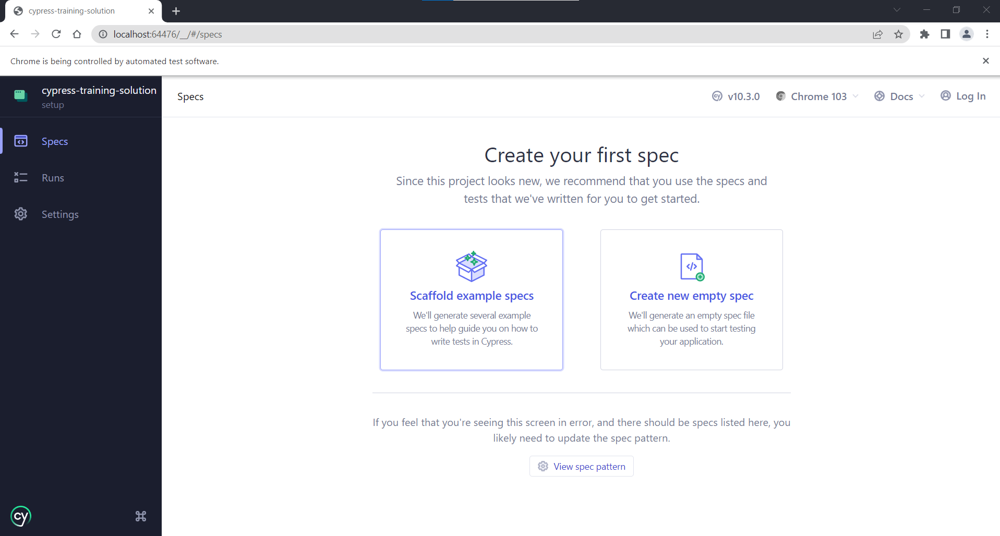

# Sesion 4: E2E UI Tests con Cypress

## Objetivo
Este ejercicio tiene como objetivo aprender a configurar y ejecutar pruebas de end to end usando la UI por medio de [cypress](https://www.cypress.io/).

## Actividad

### 1. Preparacion

1. Instalar la ultima version LTS de Node disponible. v.18.14.x A la fecha (Marzo de 2023)
1. Crear un repositorio llamado "cypress-excercise" en GitHub, puede seleccionar opciones de inicializacion de repositorio si así lo desea.
1. Clone el repositorio creado anteriormente en su computador
1. Crear el archivo **.gitignore** en la raíz del proyecto, luego ingrese a la página <https://www.toptal.com/developers/gitignore> y en el campo de texto digite su sistema operativo (ej: windows, osx, macos) y selecciónelo de la lista de autocompletar. Repita este paso para su entorno de desarrollo (ej:vscode, sublime, intellij, jetbrains), también agregue la palabra `node` y por ultimo `CypressIO`. Presione el botón "Create" para crear el archivo que contendrá una lista de carpetas y archivos de exclusión y copie su contenido dentro del archivo **.gitignore**.
1. Subir estos cambios al repositorio. 

### 2. Creacion del Proyecto

1. Crear una nueva rama local ejecutando por consola `git checkout -b setup`.
1. Ejecutar en consola `npm init` y colocar la siguiente información:
   | Parámetro | Valor |
   | ------------------ | --------------------------------------------- |
   | **Name** | cypress-training |
   | **Version** | _[Por Defecto]_ |
   | **Description** | This is a Workshop about Cypress |
   | **Entry Point** | _[Por Defecto]_ |
   | **Test Command** | `cypress open` |
   | **Git Repository** | _[Por Defecto]_ |
   | **Keywords** | ui-testing, dojo, practice, cypress |
   | **Author** | _[Su nombre]_ <_[Su correo]_> (_[su GitHub]_) |
   | **License** | MIT |

1. Realizar un commit donde incluya los archivos creados con el mensaje “setup project configuration” y subir los cambios al repositorio:

   ```bash
   git add .
   git commit -m "setup project configuration"
   git push origin setup
   ```

1. Crear un pull request (PR), aprobarlo, acto seguido realizar el "merge" usando la opcion "squash and merge" (squash te permite unir todos los commits en un solo, es más por un concepto de organización). 
1. Borrar la rama "setup"
1. Posteriormente, en su rama local "main" realice el pull para traer los cambios mergeados en el PR.

   ```bash
   git checkout main
   git pull
   ```

### 3. Instalación de Cypress

1. Ejecutar el siguiente comando:

   ```bash
   npm install -D cypress
   ```

2. Esto instalará cypress dentro del **node_modules**. Para verificar la correcta instalacion e iniciar la configuracion para ver el demo de cypress, ejecutamos el siguiente comando:

   ```bash
   npm test
   ```

   - Si te aparece un mensaje de Windows Defender similar al de la imagen, selecciona todas las opciones y presiona el boton Allow Access.
     

   - Después, se abrirá una ventana dandote la bienvenida Cypress. Te dara a escoger entre dos opciones (E2E Testing y Component Testing). Selecciona E2E Testing.
     

   - Luego, Cypress mostrará el contenido de 4 archivos que agregará a nuestro proyecto: `cypress.config.js`, `cypress\support\e2e.js`, `cypress\support\commands.js`, `cypress\fixtures\example.json`. Presiona el boton de continuar.
     

   - A continuación, Cypress te pedira que selecciones uno de los navegadores soportados. Seleccionaras `Chrome`, y luego presionaras el botón "Start E2E Testing in Chrome".
     

   - Después, Cypress abrirá una ventana de Chrome y te pedira que elijas entre dos opciones. Selecciona "Scaffold example specs". Esto generará varios archivos de prueba, con ejemplos acerca de como utilizar cypress.
     

   - Por último, Cypress te mostrara todos los archivos que ha generado. Presiona el boton "Okay, I got it!"

3. Selecciona alguno de los archivos que cypress ha generado, para ejecutar las pruebas de ejemplo. Es aquí donde vemos cómo funciona la magia de cypress. Una vez finalice, cerramos la ventana de cypress.

4. Agregue a la seccion de cypress de su archivo **.gitignore** las siguientes líneas para no subir las pruebas que hacen parte del demo:

   ```bash
   cypress/e2e/1-getting-started/*
   cypress/e2e/2-advanced-examples/*
   ```

5. Observar que se crea una carpeta llamada **cypress** con [la siguiente estructura](https://docs.cypress.io/guides/core-concepts/writing-and-organizing-tests.html#Folder-Structure)

6. Crear una rama y realizar un commit donde incluya los archivos creados y/o modificados en esta sección, con el mensaje “setup cypress configuration” y subir los cambios al repositorio

7. Crear un pull request (PR), y realizar el merge.

8. Una vez hemos obtenido la aprobación de los revisores, realizar el merge a main seleccionando la opción “squash and merge” (squash te permite unir todos los commits en un solo, es más por un concepto de organización). Posteriormente, en su rama local "main" realice el pull para traer los cambios mergeados en el PR.

### 4. Creando la primera prueba

Una vez hemos ejecutado las pruebas de ejemplo, eliminamos las carpetas que contienen ejemplos: `cypress/e2e/1-getting-started` y `cypress/e2e/2-advanced-examples`.

1. Creamos un archivo llamado `google.cy.js` dentro de la carpeta `/cypress/e2e/` con el siguiente contenido:

   ```javascript
   describe("This is my first cypress test", () => {
     it("should have a title", () => {
       cy.visit("https://www.google.com/");
       cy.title().should("eq", "Google");
     });
   });
   ```

2. Ejecutar el comando `npm run test` para correr la prueba (deberas seleccionar la opcion "E2E Testing" y despues seleccionar nuevamente el navegador chrome y presionar el boton "Start E2E Testing in Chrome"). Una vez finalice y si todo está bien veremos que la prueba paso satisfactoriamente:

   

3. Cree una nueva rama y un nuevo Pull Request con estos cambios (incluya una captura de pantalla donde se evidencie que las pruebas estan pasando). No olvide actualizar su rama `main` una vez se haya hecho el proceso de Squash and Merge.

### 5. Automatizando un Login

Ahora que hemos visto de manera general como usar cypress. Pasemos a automatizar un caso de uso un poco mas acercado a la realidad. En este caso utilizaremos la siguiente pagina de demo: https://www.saucedemo.com/

Las pruebas que realizaremos se centraran en el proceso de Autenticacion.

1. Crearemos el archivo `saucedemo.login.cy.js` dentro de la carpeta `/cypress/e2e/`. Con la siguiente estructura:
   ```javascript
   describe("Verifying Login Process for SauceDemo", () => {
   });
   ```

1. La primera prueba que realizaremos, es verificar el proceso de login, con usuario incorrecto. Encuentra los selectores indicados para los campos de usuario y contraseña, asi como para el boton de "Login"
   ```javascript
   describe("Verifying Login Process for SauceDemo", () => {
     beforeEach(() => {
       cy.clearCookies();
       cy.visit("https://www.saucedemo.com/");
     });

     it("Login should notify when a wrong username/password combination is used.", () => {
       cy.get("locator-for-username").type("testUser");
       cy.get("locator-for-password").type("testPass");
       cy.get("locator-for-login").click();

       // Assertion for error message
       cy.get("[data-test='error']").should(
         "include.text",
         "Username and password do not match any user in this service")
     });
   });
   ```

   <details>
   <summary><b><u>Nota:</u></b> Si tienes problemas con la ejecucion de las pruebas en esta pagina, te sale un mensaje de error de timeout</summary>

   Modifica la configuracion para e2e del archivo: `cypress.config.js`

   ```javascript
   e2e: {
     chromeWebSecurity: false,
     setupNodeEvents(on, config) {
       // implement node event listeners here
     },
   },
   ```

   </details>

1. La segunda prueba, consistira en verificar que podemos ingresar con el usuario "standard_user". Agrega este codigo dentro del bloque de `describe` ya existente.
   ```javascript
     it("Login should work for existing user.", () => {
       cy.get("locator-for-username").type("standard_user");
       cy.get("locator-for-password").type("secret_sauce");
       cy.get("locator-for-login").click();

       // Assertion that verifies that products list is displayed
       cy.get(".title").should("have.text", "Products")
     });
   ```

## Tarea

Crear un nuevo archivo llamado `saucedemo.cart.cy.js`. Automatizar el proceso de agregar los siguientes productos "Sauce Labs Backpack" y "Sauce Labs Onesie" al carrito de compras. Verificar que dichos productos se encuentran agregados al carrito de compras.

### Rubrica
1. Entregar el repositorio "cypress-excercise" y se encuentra evidencia que se ha seguido GitHub Flow en el desarrollo de los puntos: 20%
2. Configuracion correcta del proyecto y cypress: 20%
3. Se incluye el codigo hecho en clase para los puntos 4 y 5 del ejercicio en clase: 20%
4. Se implementa correctamente el proceso de agregar productos al carrito de compra: 40%